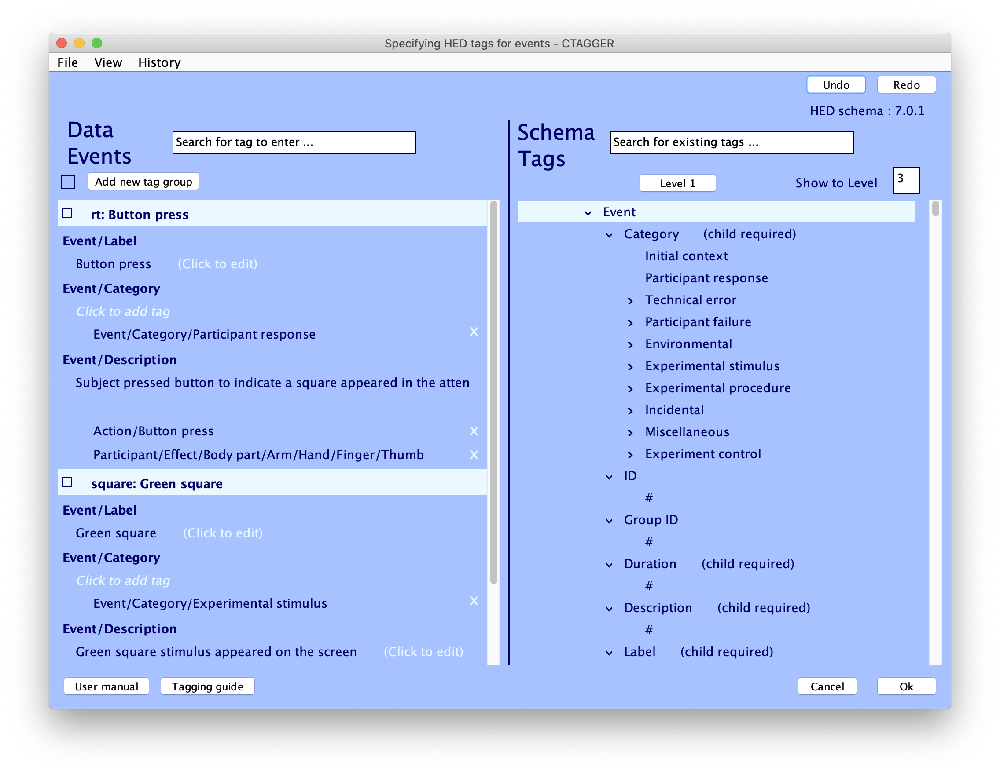
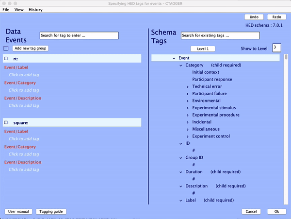
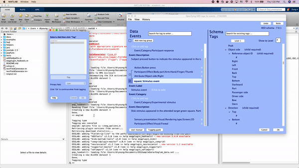
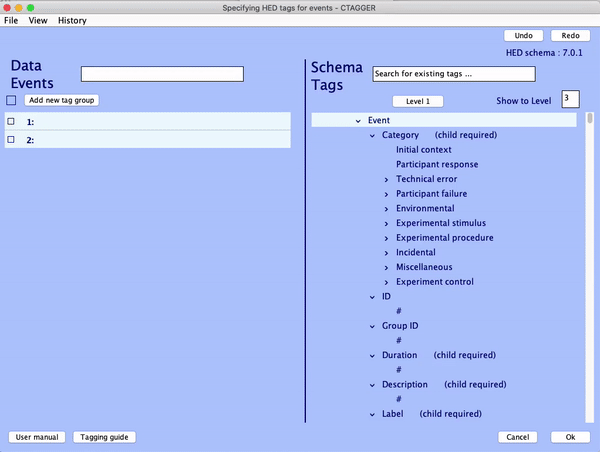
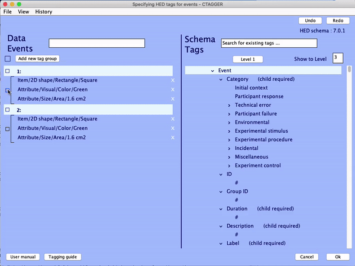
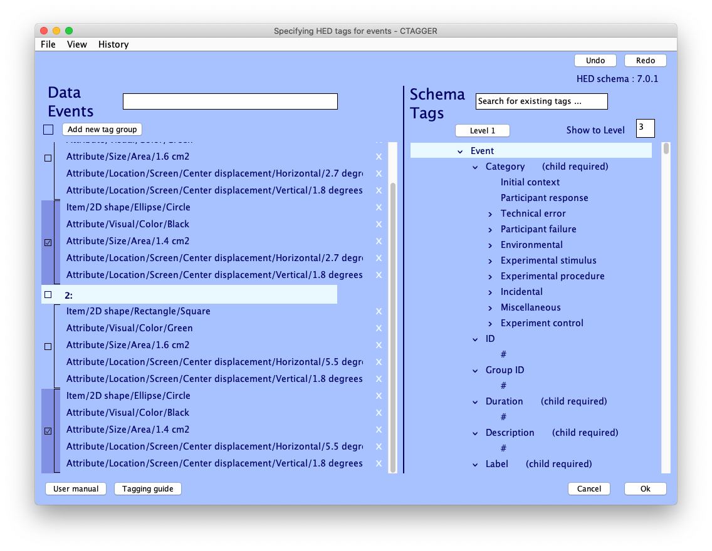

**Events Should Have HED Tags**: ("What does '*Event code 17*' mean?") Traditionally, software systems for event-related EEG data collection and analysis have used simple numeric codes (2,17, 253) whose meaning is hopefully saved with the data somewhere, or else given a brief text label ('*Target*'). But with the creation and availability of new analysis methods for extracting information, EEG data are valuable long after their first publication, and will in near future become even more so as public *data archives and tool repositories (DATRs)* sitting on available clouds or high-perrormance (super) computer networks become active and available. Archiving data in private or public DATRs allows further, intensive data analyses as well as meta-analyses across studies with different designs. All of this requires that the more exact nature of the recorded experimental events are saved and accessible in an agreed format. Today the *only* such format is the **Hierarchical Event Descriptor (HED)** system of Nima Bigdely-Shamlo, Kay Robbins developed at the Swartz Center, UCSD (REF). Accordingly, HED has been accepted in the rapidly emerging BIDS standards for data archive. In conjunction with a project to build a DATR ('NEMAR') for human neuroelectromagnetic data under NIMH funding, we (Scott Makeig, Arno Delorme, Amit Majumdar, Russ Poldrack) and our colleagues are creating and polishing tools to make adding more detailed HED tag descriptions of experimental events to new or existing data as simple as possible, and for using HED tags within EEGLAB to create custom event collections based on their detailed HED tag descriptions. Enhanced HED tutorial websites and videos we will be online soon.

**HED Tagging**: Most people who have worked with EEG data are familiar with the practice of using brief lab-specific labels (*'Target'*) or arbitrary integers (*'event type 17'*) to annotate what events happened when during an experiment. Re-using a collected dataset for new analysis then involves reading the reported experiment description carefully (if available) to gain some meaning of those event codes. However, the lack of detail expressed in an event code prevents researchers from flexibly combining events across studies based on the precise nature of experimental events (*'Are green stimuli processed differently than red, no matter their shape?'*, *'Is there any EEG biomarker of the participant having viewed a bridsound rather than a sine tone?'*, etc.). Nor are researchers able to most efficiently evaluate which events to include in their analysis (*'Only blue targets??'*). Meanwhile, the success of various data sharing efforts now begin to allow EEG researchers to access an increasing number of datasets from many studies involving different designs. This opens the possibility of applying advanced machine learning algorithms to analyze EEG dynamics based on a larger and more diverse scale of data. Unfortunately, it would be infeasible to actualize these possibilities, given the constraints imposed by current practises in experimental event annotation.

**The HED System**:The *Hierarchical Event Descriptor (HED)* system provides a standardized way to describe precisely the nature of recorded or later identified experimental events. Using HED-tagged datasets, researchers will no longer have to deal with meaningless event codes. Moreover, analysis tools will be able to aggregate events across a large number of studies with minimal human supervision. The HED system comprises a schema (syntax and agreed upon top-level tag hierarchy) and a software ecosystem supporting annotation, validation, and extraction of EEG events using HED tags. The [*HED schema*](http://www.hedtags.org/display_hed.html) specifies a collection of HED tags in use to annotate events, organized in a partially hierarchical structure. Software supporting the use of HED event tagging currently includes the EEGLAB plug-in [*HEDTools*](https://github.com/hed-standard/hed-matlab/tree/master/EEGLABPlugin), the GUI-based tagging program [*CTAGGER*](https://github.com/hed-standard/hed-java/blob/master/java/tagging/CTagger.jar) (now bundled with the *HEDTools* plug-in), and the online [*HED validator*](http://visual.cs.utsa.edu/hed/validation).

**Using HED and HEDTools**: This guide will focus on the EEGLAB plug-in *HEDTools* for event annotation, extraction, and validation using HED tags. After reading this guide, you will be familiar with the HED schema and how to associate HED tags with events. You will also see how you can use HED-annotated events in your analysis. Your understanding will generalize beyond the EEGLAB environment, as you can use any other data analysis tool environment to work with HED.

[I. Event annotation & extraction with EEGLAB plug-in *HEDTools*](#I)

1. [What is EEGLAB?](#I.1)
2. [Installing EEGLAB and load dataset](#I.2)
3. [Adding tags using CTAGGER](#I.3)
4. [Validating tagged dataset](#I.4)
5. [Extracting HED-annotated events](#I.5)

[II. HED schema and the art of tagging](#II)

## <a name="I">I. Event annotation & extraction with EEGLAB plug-in *HEDTools*</a>
#### <a name="I.1">1. What is EEGLAB? Setting up the plug-in</a> 

[EEGLAB](https://sccn.ucsd.edu/eeglab/index.php) is a most widely used EEG software environment for analysis of human electrophsyioloigcal (and related) data. It combines both graphical and command-line user interfaces, making it friendly for both beginners who may who prefer a more flexible, automated way of analyzing data, and experts, who can easily extend the EEGLAB tool environment by making new EEGLAB compatible functions and/or publishing EEGLAB plug-in toolboxes that are then immediately available, through the EEGLAB graphic user interface (GUI) to anyone who downloads them.

The plug-in *HEDTools* can be installed using one of the following ways:

1. From the EEGLAB Plug-in Manager: Launch EEGLAB and go to **File -> Manage EEGLAB extension**. The plug-in manager GUI will pop up. From this GUI look for and select the plug-in *HEDTools* from the main window, then click into the Install/Update button to install the plug-in.
2. From the web: Download the zip file with the content of the plug-in *HEDTools* either from [GitHub](https://github.com/hed-standard/hed-matlab/blob/master/EEGLABPlugin/HEDTools2.5.0.zip) or from the EEGLAB [plug-ins summary page](https://sccn.ucsd.edu/eeglab/plugin_uploader/plugin_list_all.php). Decompress the zip file into the folder *../eeglab/plugins* and restart EEGLAB.

#### <a name="I.2">2. Load dataset and start tagging</a>

Once you have EEGLAB main window opened, load the dataset into the software. For this quick guide, we are using the EEGLAB tutorial dataset, which you can download [here](https://sccn.ucsd.edu/mediawiki/images/9/9c/Eeglab_data.set). Click on **File > Load existing dataset** and select the dataset. 

For a description of the dataset and the meaning of event codes, we check its description by selecting **Edit -> About this dataset**:

Our goal is to use HED tags to describe events, so that anyone who will reuse the dataset in the future won't need to read the description again.

#### <a name="I.4">3. Adding tags using CTAGGER</a>

From EEGLAB menu, select **Edit -> Add/Edit event HED tags** which will bring up a window to specify options for tagging:

We'll proceed with the default options which uses the latest version of the official HED schema. It also assumes that you are tagging the dataset for the first time and not re-using any previous tagging scheme. Lastly, you will use CTAGGER and event field selector panel for tagging. Hit **Ok**. 

A window will pop up to let you choose which event field to use for tagging:

Fields listed in the select box are extracted from the EEG.event fields, ignoring fields "latency", "epoch", and "urevent". *Primary field* is the field used to specify what kind of event is occurring while the other fields are subfields used to specify conditions or subcategories within the event. In most cases with EEGLAB, "type" is the primary field which is also the first field we want to tag. Select "type" in the select box and click **Tag** which will open up CTAGGER:

CTAGGER was built to facilitate the process of tagging. On the left side, we have the **Data Events** panel containining values of the selected event field and their associated tags. The right panel **Schema Tags** contains all available tags organized in the hierarchical structure as defined by the HED schema. The process of tagging is simply choosing tags from the schema to associate with an event value. 

First we'll add a short label and a detailed description to the event codes using tag *Event/Label* and *Event/Description*. These tags are meant for human readability and will be ignored during machine processing. A restriction with HED tags is that tag value should not contain any comma, which is a common mistake with event description. Next, we want to generally categorize these events using tag *Event/Category*. "square" is a stimulus presentation event so we'll use tag *Event/Category/Experimental stimulus* and "rt" is subject's response so we use tag *Event/Category/Participant response*. 

With those three information, the dataset can now be shared and researchers who re-use the dataset can quickly understand the meaning of the event codes. However, the power of HED is that you can finely detail the nature of the events so that analysis tools can automatically aggregrate events using tags with minimal human supervision later on. So let's keep tagging.

Let's start with partcipant responses events. We denote the type of action participant performed using *Action/* tags. In this case, it's *Action/Button press* since subject was asked to press a button when they see the target stimulus. We can go to further details in describing the body part affected by the action. In this case the subject was asked to use the right thumb to press the button. We'll first add a tag group to **rt**. A tag group contains a main tag and *Attribute/* tags that describe the main tag. Searching for keyword "thumb" in the HED schema shows *Participant/Effect/Body part/Arm/Hand/Finger/Thumb*. We add the tag to the group. Similarly, searching for "right" shows multiple results yet we care only about ones with *Attribute/* prefixes. *Attribute/Object side/Right* seems to be the right tag. Clicking on the tag brings us down to the location of the tag on the HED schema. Hovering over "Object side" shows the tag's description on tooltip: "Could be the left, right, or both sides of a person or a vehicle" which confirms our presumption. So we add the tag to the group and complete describing the participant response events.

We will next describing stimulus events. We'll describe how the sensory was presented to the participant using */Sensory presentation/* tag. In this case a visual stimulus was presented on a 2D screen so we use */Sensory presentation/Visual/Rendering type/Screen/2D*. We also want to describe the expected effect of the stimulus to the participant using *Participant/Effect/* tags. We want the subject to see the stimulus so we add tag *Participant/Effect/Visual*. Even better, we can use tag *Participant/Effect/Visual/Foveal* to denote that subject focused foveally on the stimulus presentation. 

We also want to describe the stimulus presentation itself. In this study, the stimulus is a filled circular disk appearing randomly in one of five green-outlined squares spaced evenly on a horizontal plane above the center fixation cross. For the tutorial sample dataset, we only include trials in which the disk appeared in the two left-most squares, annotated by event field "position". Thus to also include position information of the stimulus, we will switch to tag field "position". As we have finished tagging field "type", hit *Ok* on the current CTAGGER window. The field selection window becomes active again, and this time we choose "position" before hitting **Tag**. CTAGGER will appear again and this time with "position" event values "1" and "2", indicating stimulus appeared in the square at about 5.5 degree and 2.7 degree of horizontal visual angle respectively. 

A stimulus includes a circular disk and the green square so we'll use two groups to describe them separately. We'll first describe the bounding square. Click on the checkbox next to button "Add new tag group" to select both values and then click the button to add a group to both of them. Select the two newly added groups. We use tag */Item/2D shape/Rectangle/Square* and */Attribute/Visual/Color/Green* to describe the green square. We can also denote the area of the square using tag */Attribute/Size/Area*. Clicking on the tag will pop up a window prompting for a value. We enter "1.6" as the value and select "cm2" as the unit, rendering a complete tag */Attribute/Size/Area/1.6 cm2*. 

We also wants to include information about their positions. For event value "1", we'll add tags *Attribute/Location/Screen/Center displacement/Horizontal/2.7 degrees* and *Attribute/Location/Screen/Center displacement/Vertical/1.8 degrees* to describe horizontal and vertical visual angle respectively. For event value "2", we'll add *Attribute/Location/Screen/Center displacement/Horizontal/5.5 degrees* and *Attribute/Location/Screen/Center displacement/Vertical/1.8 degrees*. We have just described the green square.

We'll add a second group to describe the circular disk. Similar to tagging the square, we'll add tags */Item/2D shape/Ellipse/Circle*, */Attribute/Visual/Color/Black*, and */Attribute/Size/Area/1.4 cm2* to describe the disk and  *Attribute/Location/Screen/Center displacement* tags to describe its position accordingly.

You just finished tagging the dataset! *HEDTools* will generate the final HED string for each event by concatenating all tags associated with the event values of that event, seperated by commas, and put the string in a new field **usertags**. From now on you can use these tags to extract epochs for your analysis and  with other HED-annotated dataset you can do meta-analysis!

#### <a name="I.4">4. Validating a HED-tagged dataset</a>

#### <a name="I.5">5. Extracting HED-tagged events and event-locked data epochs from an EEGLAB dataset</a>

## <a name="II">II. The HED schema and the art of event annotation</a>

